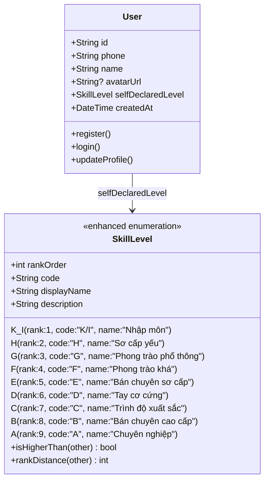
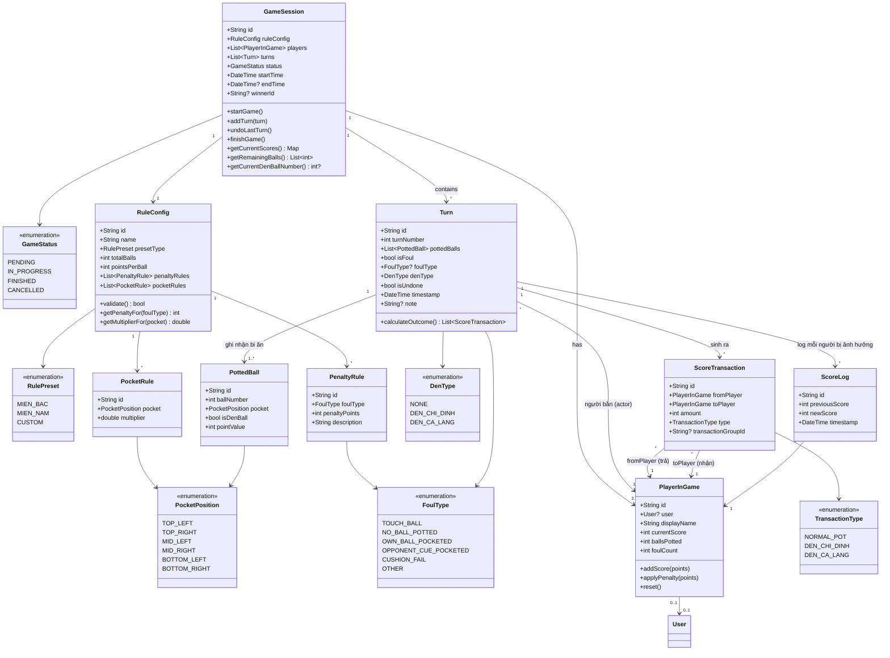
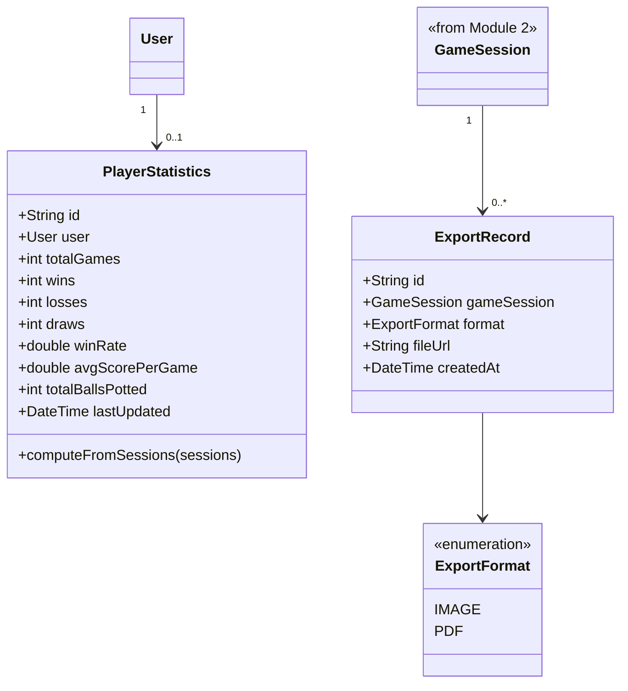
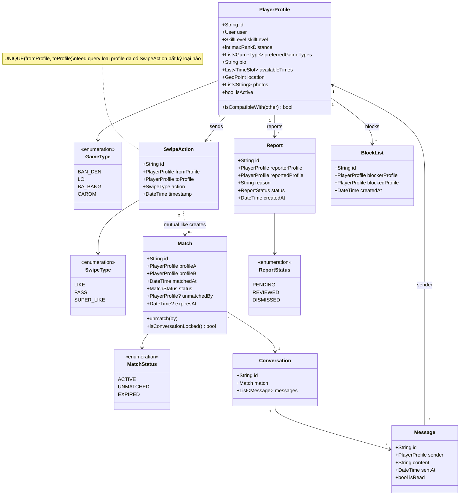
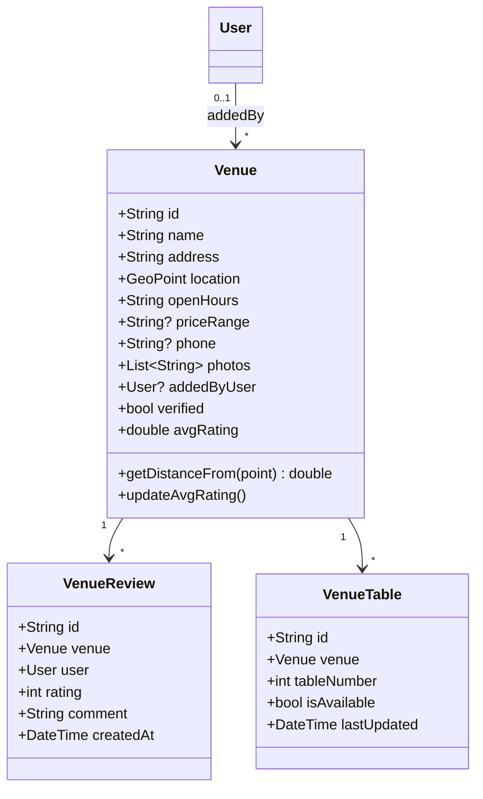
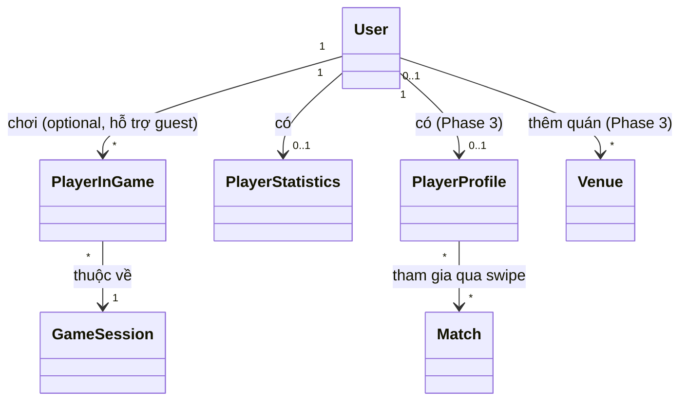

# Thiết kế Class & Entity — App Bida (Flutter)

Tài liệu này mô tả domain model chi tiết cho từng module, kèm UML class diagram (Mermaid).
Đơn vị đo: `GeoPoint` = {lat, lng}. Các trường có `?` là nullable/optional.

---

## 1. Module: User & Auth

**Vai trò:** User là entity gốc, liên kết tới `PlayerInGame` (chơi bida), `PlayerProfile` (tìm đối), `PlayerStatistics` (thống kê), `Venue` (người thêm quán).

**Ghi chú thiết kế:**

- Đây là **enhanced enum** (Dart hỗ trợ enum có field + method), không phải enum phẳng — vì mỗi hạng cần cả `code` ("K/I", "H"...), `displayName` và `description` dài để hiển thị UI (vd: tooltip giải thích hạng khi user chọn).
- `rankOrder` (1→9) là **số nguyên dùng để so sánh/lọc** — đây là lý do quan trọng nhất phải nâng cấp: Module 4 (matchmaking) cần lọc đối thủ trong khoảng rank gần nhau (vd: ±1-2 hạng) chứ không thể so sánh trực tiếp bằng enum phẳng.
- Đặt tên field trong `User` là `selfDeclaredLevel` (không phải `level`) để nhấn mạnh đây là **hạng tự khai báo** — không phải hạng được hệ thống tính toán. Nếu sau này muốn có "hạng tính toán từ thắng/thua" (elo-like), nên thêm field riêng `computedRating: int` trong `PlayerStatistics` (Module 3), tránh nhầm lẫn 2 khái niệm.
- Text mô tả dài (`description`) nên lưu ở dạng **static lookup table trong code** (không lưu DB) vì đây là dữ liệu tĩnh, không đổi theo user.

---

## 2. Module: Scoring — Tính điểm bắn đền (Core / MVP)

Đây là module quan trọng nhất, cần rule engine linh hoạt vì luật "bắn đền" khác nhau theo vùng miền.

**1. Bổ sung `PottedBall` + `PocketPosition` (thay cho `ballsPottedThisTurn: int`)**

- Mỗi lượt (`Turn`) giờ ghi nhận **danh sách bi ăn cụ thể** (`pottedBalls`), mỗi bi biết rõ: ăn bi số mấy (`ballNumber`), vào lỗ nào trong 6 lỗ chuẩn (`PocketPosition`), có phải bi đền/bi chỉ định không (`isDenBall`), và giá trị điểm của riêng bi đó (`pointValue`) — vì `PocketRule` cho phép lỗ giữa nhân hệ số khác lỗ góc.
- `GameSession.getRemainingBalls()` và `getCurrentDenBallNumber()` được **tính toán (derived)** từ toàn bộ `PottedBall` đã ghi nhận trừ đi `RuleConfig.totalBalls`, chứ không lưu state riêng — tránh 2 nguồn dữ liệu bị lệch nhau (số bi còn lại phải luôn nhất quán với lịch sử lượt bắn).

**2. Bổ sung `ScoreTransaction` (thay cho `Turn.scoreChange: int`)**

- Điểm/tiền giờ được mô hình như **giao dịch có 2 phía**: `fromPlayer` (người trả) → `toPlayer` (người nhận), với `amount` luôn dương. Đây là cách duy nhất biểu diễn đúng bản chất zero-sum của luật đền.
- **Đền cả làng** (`DenType.DEN_CA_LANG`, ví dụ bàn 4 người): 1 `Turn` sinh ra **N-1 `ScoreTransaction`** (người phạm lỗi trả cho từng người còn lại), tất cả share chung `transactionGroupId` để UI có thể hiển thị gộp ("A đền cả làng lượt 12") dù về data là nhiều dòng riêng lẻ.
- **Đền chỉ định** (`DenType.DEN_CHI_DINH`, ví dụ ăn bi đền của B): chỉ sinh **1 `ScoreTransaction`** từ A → B.
- `Turn.calculateOutcome()` là nơi rule engine thực thi toàn bộ logic: đọc `pottedBalls` + `denType` + tra `RuleConfig` (cả `PenaltyRule` lẫn `PocketRule`) → trả về danh sách `ScoreTransaction` → áp dụng vào `PlayerInGame.currentScore` của từng người liên quan.
- `ScoreLog` được giữ lại nhưng đổi vai trò: không còn gắn 1-1 với `Turn` như cũ, mà là **snapshot điểm số sau khi nettinng tất cả transaction trong lượt đó, cho từng người chơi bị ảnh hưởng** (1 `Turn` với đền cả làng sẽ tạo ra N dòng `ScoreLog`, mỗi người 1 dòng). Nhờ vậy `undoLastTurn()` chỉ cần lặp qua các `ScoreLog` của `Turn` đó để revert `previousScore` cho từng người và đánh dấu `Turn.isUndone = true`, bất kể lượt đó có bao nhiêu giao dịch.

---

## 3. Module: History & Statistics

**Ghi chú thiết kế:**

- Không tạo entity `GameHistory` riêng — lịch sử chính là tập `GameSession` có `status = FINISHED`, tránh trùng dữ liệu. Màn hình "Lịch sử" chỉ là 1 query/view.
- `PlayerStatistics` là bảng **denormalized** (tính sẵn), cập nhật mỗi khi 1 `GameSession` kết thúc — tránh phải tính lại từ đầu mỗi lần mở app.

---

## 4. Module: Matchmaking (Tìm đối kiểu Tinder)

**Ghi chú thiết kế:**

- `PlayerProfile.isCompatibleWith(other)` dùng `SkillLevel.rankDistance()` (Module 1) + `maxRankDistance` do user tự set (vd: chỉ muốn gặp người trong ±2 hạng) — lọc ngay ở tầng query feed, tránh hiện người hạng K ghép với người hạng A gây trải nghiệm tệ cho cả hai bên.
- **Vá lỗ hổng — Pass vĩnh viễn:** ràng buộc `UNIQUE(fromProfile, toProfile)` trên `SwipeAction` đảm bảo mỗi cặp chỉ có tối đa 1 record. Query lấy feed luôn `WHERE toProfile NOT IN (SELECT toProfile FROM SwipeAction WHERE fromProfile = :me)` — nghĩa là bất kể Like hay Pass, người đó **không bao giờ hiện lại** trong feed của mình nữa. Nếu sau này muốn tính năng "xem lại người đã Pass" (kiểu Tinder Rewind trả phí) thì mới cần query riêng trên bảng này, không cần đổi schema.
- **Vá lỗ hổng — vòng đời `Match`:** trước đây chỉ có `ACTIVE/ARCHIVED` không đủ. Giờ có `UNMATCHED` (1 trong 2 bên chủ động huỷ, lưu `unmatchedBy` để biết ai huỷ) và `EXPIRED` (match tạo ra nhưng không ai nhắn tin trong X ngày, dùng `expiresAt` để job nền tự chuyển trạng thái — khuyến khích người dùng chủ động nhắn sớm). `Conversation.isConversationLocked()` suy ra từ `match.status != ACTIVE` (không lưu field riêng để tránh 2 nguồn state lệch nhau) — khi khoá thì UI chỉ cho xem lại lịch sử chat, không cho gửi tin mới.
- `Match` chỉ được tạo khi tồn tại **2 `SwipeAction` LIKE** (hoặc ít nhất 1 `SUPER_LIKE`) giữa 2 profile theo cả 2 chiều — nên xử lý ở backend (Supabase function/trigger), không nên tính ở client để tránh gian lận.
- `Report` và `BlockList` tách riêng vì mục đích khác nhau: Report cần workflow duyệt (moderation), Block chỉ là hành động 1 chiều ẩn user khỏi feed — cần có từ đầu vì tính năng này tiếp xúc người lạ ngoài đời thật.

---

## 5. Module: Venue Map (Tìm quán bida)

**Ghi chú thiết kế:**

- `addedByUser` cho phép **crowdsource** dữ liệu quán (vì data ban đầu sẽ thưa) — nhưng có cờ `verified` để admin duyệt trước khi hiển thị công khai, tránh spam địa điểm ảo.
- `VenueTable` (số bàn trống real-time) đánh dấu là tính năng **tương lai** — chỉ khả thi nếu chủ quán chủ động cập nhật, nên để version sau, không nằm trong Phase 3 ban đầu.

---

## 6. Diagram tổng hợp — Quan hệ giữa các module

**Đọc diagram này để thấy:** `User` là entity trung tâm nhưng **không bắt buộc** cho Phase 1 (chơi guest được) — chỉ trở thành bắt buộc khi cần Phase 3 (matchmaking, venue crowdsource) vì cần định danh để chat/report an toàn.

---

## 7. Mapping sang tầng dữ liệu Flutter

| Module                                     | Local (Drift/SQLite)     | Remote (Supabase/Firebase)                |
| ------------------------------------------ | ------------------------ | ----------------------------------------- |
| Scoring (GameSession, Turn, RuleConfig...) | Bắt buộc — offline-first | Optional (sync sau nếu cần backup)        |
| History & Statistics                       | Tính từ local trước      | Optional sync                             |
| Matchmaking                                |                          | Bắt buộc — cần realtime + auth            |
| Venue Map                                  | Cache local (đọc nhanh)  | Nguồn chính (crowdsource + Google Places) |

**Khuyến nghị code:** dùng `freezed` cho immutable model classes (map trực tiếp từ các class ở trên), `drift` generate table từ model cho Scoring, và 1 lớp `Mapper`/`Repository` riêng để chuyển đổi giữa model local ↔ model remote (tránh model bị "dính" logic của cả 2 nguồn dữ liệu).
